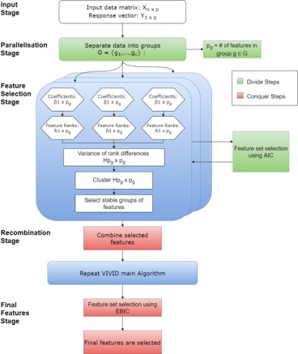
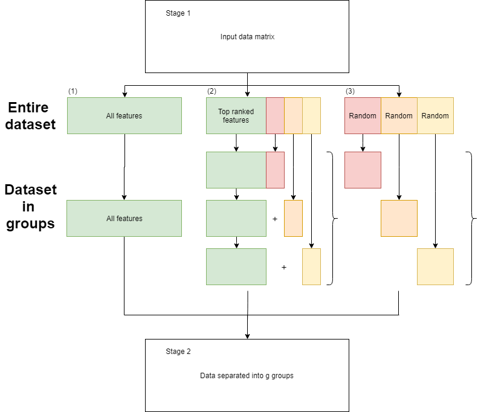
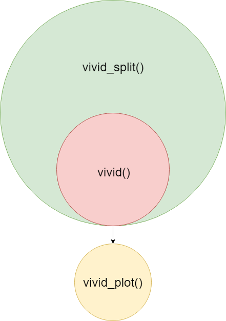

# The **VIVID** package

The **VIVID** (Variability of Variable Importance Differences) package
implements both a feature selection method and visualization for complex
data. Similar to filter methods, we utilize feature rankings but then
proceed to make decisions on how these ranks change over resamples. This
information is then visualized through a heat map style plot which
highlights groups of features with lower variability in there rankings.
When using this package, you are able to identify features which are
shown to be important when modeling a response feature such as treatment
and control groups of a disease. You are also then able to use
visualization to see how this group of features compares with other
suitable candidate groups of a similar nature.

## Goals

Within VIVID we aim to achieve a variety of goals which include:

1.  Remove the arbitrary cut-off employed when selecting the top
     features
    through a filtering style method.
2.  VIVID uses more re-sampling information before aggregating the data
    down to single values.
3.  Considers pairwise comparisons of importance metrics over B
    re-samples.
4.  Provides a visualization method, through which key features can be
    identified.

# Methodology

When a regression model is fit to data, the size of corresponding
coefficients, relative to other features, highlights how important a
given feature is. We use the feature rankings of these measures to then
observe how pairs of features change relative to other features around
them. Groups of features with smaller variability are then identified
and considered a candidate group. Given a dataset where only a few
features are important (sparse), the majority will have true
coefficients equal to 0 creating a large group of features whose ranks
vary significantly. These candidate models are then compared and the
most optimal solution picked. A detailed version of the method is
outlined below.

## VIVID Method

1.  Obtain a dataset containing a design matrix \(X\) with \(p\)
    features and \(n\) observations and a response vector \(y\) of
    corresponding length with two classes.
2.  Fit regression models to resampled data:
      - Bootstrapping is performed by generating new observation weights
        from the data. These weights are generated from an \(exp(1)\)
        distribution and sum to \(n\).
      - A logistic regression is then fit to each re sample using Ridge
        estimates.
3.  Calculate measures of feature importance \(s_i\) by taking the
    absolute value of the regression coefficients,
    \(s_i = |\hat{\beta}_i|\).
4.  Calculate the variance of each pairwise comparison of ranks between
    two features,
    .
5.  The features are then clustered using the corresponding rows in the
    \(p\) by \(p\) matrix \(H\) constructed in step (4).
6.  The algorithm then searches through the dendogram to find the groups
    of features with the lowest pairwise variance.
7.  Once the groups of features have been identified, the Extended
    Bayesian Information Criterion (EBIC) is then used to identify the
    best group of features.

Due to the construction of a \(p\) by \(p\) matrix, if \(p\) is two
large a divide and conquer method is implemented, as seen in Figure 1.

Once **VIVID** has been applied to a dataset, there is also a way of
visualizing the information gathered throughout.

# Installation

``` r
library(devtools)
devtools::install_github("binfnstats/VividR")
```

``` r
library('VIVID')
```

# The *sacurine* dataset

Insert some information about the dataset here.

# Hands-on

## Required Packages

For the following example the ‘ropls’ package is needed. The ‘ropls’
package contains the sacurine dataset which this example is based
around.

``` r
if (!requireNamespace("BiocManager", quietly = TRUE))
    install.packages("BiocManager")
BiocManager::install("ropls") #sacurine data
```

``` r
library('ropls')
```

## *VIVID* feature selection

The first step is to identify all the features to be included in the
comparison. Since no pre-filtering step is being implemented we will use
all features.

``` r
data("sacurine") #Load sacurine dataset from the 'ropls' package

dat <- sacurine$dataMatrix
outcomes <- sacurine$sampleMetadata$gender
```

The remaining parameters which can be set adjusted:

  - **bootstraps**: number of resamples to be completed (should change
    depending on data size)
  - **cores**: how many cores to use for the parallel implementation of
    model fitting.
  - **seed**: seven digits to allow to for reproducible results.
  - **lambda**: the values of lambda used to select the optimal
    regression fit; see **glmnet** for explanation.
  - **compareMethod**: method of comparison between models. EBIC is
    chosen as the default method.
  - **gamma**: If **compareMethod** = “EBIC” then this feature is used.
  - **minSize**: When identifying important sets of features when
    searching through the dendogram,

If no input is given, then each feature will resort to their default
values:

  - bootstrap = 100
  - cores = 1
  - seed = 1234567
  - lambda = lambda.1se
  - compare\_method = EBIC
  - gamma = 1
  - min\_size = 2

<!-- end list -->

``` r
vivid.sacurine <- vivid(x = dat,
                        y = outcomes,
                        bootstraps = 75,
                        cores = parallel::detectCores() - 1,
                        seed = 1234567,
                        lambda = 'lambda.min',
                        compareMethod = 'BIC')
```

The function returns the following outputs:

  - **coefficients**: a matrix containing all regression estimates from
    the resamples. This is a \(p\) by \(B\) matrix.
  - **varMat**: a matrix containing the variance of the resampled
    difference in feature ranks. This is a \(p\) by \(p\) matrix.
  - **varClust**: a hierarchical cluster analysis performed on the above
    variance matrix. This is a hclust object returned from the function
    **hclust**.
  - **selection**: a binary matrix which contains the features selected
    at each stage VIVID method. A FALSE indicates the feature is not
    included and a TRUE indicates the variable is included. This is a
    \(p\) by \(k\) matrix, where \(k\) is the number of distinct groups
    of features identified.
  - **sizes**: a vector containing the sizes of all distinct groups of
    features identified.
  - **compareMethod**: used to identify what function was supplied as an
    input.
  - **compareValues**: the values produced from the comparison method
    for the groups of features identified.
  - **optModel**: a binary vector of length \(p\) identifying the group
    of features which best optimize the comparison method, features are
    identified/ignored with the value of TRUE/FALSE respectively.
  - **optFeatures**: a vector containing the names of the features in
    the optimal group of
    features.

## Function Output

### Coefficients

``` r
vivid.sacurine$coefficients[1:6,1:6]
```

    ##                                       id bootstrap_1 bootstrap_2 bootstrap_3
    ## 1 (2-methoxyethoxy)propanoic acid isomer  0.16202130  0.05471439   0.0808198
    ## 2                     (gamma)Glu-Leu/Ile -1.12077673 -1.30949286  -1.2739411
    ## 3                      1-Methyluric acid -0.33906492 -0.40694564  -0.1069638
    ## 4                       1-Methylxanthine -0.39601029 -0.51761127  -0.2479959
    ## 5                  1,3-Dimethyluric acid -0.09361218 -0.13269045   0.1571396
    ## 6                  1,7-Dimethyluric acid  0.33097169  0.01913164   0.1534142
    ##   bootstrap_4 bootstrap_5
    ## 1   0.1225160  0.11920931
    ## 2  -1.6289512 -1.26947782
    ## 3  -0.5661693 -0.39587147
    ## 4  -0.7016126 -0.52171312
    ## 5  -0.1458598 -0.09091553
    ## 6   0.3863763  0.19437596

### Variance matrix

``` r
vivid.sacurine$varMat[1:6,1:6]
```

    ##                                        (2-methoxyethoxy)propanoic acid isomer
    ## (2-methoxyethoxy)propanoic acid isomer                                0.00000
    ## (gamma)Glu-Leu/Ile                                                   96.58847
    ## 1-Methyluric acid                                                   237.86414
    ## 1-Methylxanthine                                                    205.95027
    ## 1,3-Dimethyluric acid                                               219.24793
    ## 1,7-Dimethyluric acid                                               396.89081
    ##                                        (gamma)Glu-Leu/Ile 1-Methyluric acid
    ## (2-methoxyethoxy)propanoic acid isomer           96.58847      2.378641e+02
    ## (gamma)Glu-Leu/Ile                                0.00000      1.485989e+02
    ## 1-Methyluric acid                               148.59892      1.136868e-13
    ## 1-Methylxanthine                                163.83712      1.644728e+02
    ## 1,3-Dimethyluric acid                           156.27027      2.256746e+02
    ## 1,7-Dimethyluric acid                           319.89441      4.023020e+02
    ##                                        1-Methylxanthine 1,3-Dimethyluric acid
    ## (2-methoxyethoxy)propanoic acid isomer     2.059503e+02          2.192479e+02
    ## (gamma)Glu-Leu/Ile                         1.638371e+02          1.562703e+02
    ## 1-Methyluric acid                          1.644728e+02          2.256746e+02
    ## 1-Methylxanthine                          -5.684342e-14          2.569614e+02
    ## 1,3-Dimethyluric acid                      2.569614e+02         -2.842171e-14
    ## 1,7-Dimethyluric acid                      3.940605e+02          4.183323e+02
    ##                                        1,7-Dimethyluric acid
    ## (2-methoxyethoxy)propanoic acid isomer              396.8908
    ## (gamma)Glu-Leu/Ile                                  319.8944
    ## 1-Methyluric acid                                   402.3020
    ## 1-Methylxanthine                                    394.0605
    ## 1,3-Dimethyluric acid                               418.3323
    ## 1,7-Dimethyluric acid                                 0.0000

### Clustering

``` r
vivid.sacurine$varClust
```

    ## 
    ## Call:
    ## stats::hclust(d = varDist)
    ## 
    ## Cluster method   : complete 
    ## Distance         : euclidean 
    ## Number of objects: 109

### Feature group selection (Boolean)

``` r
vivid.sacurine$selection[1:6,1:6]
```

    ##      X.2.methoxyethoxy.propanoic.acid.isomer X.gamma.Glu.Leu.Ile
    ## [1,]                                    TRUE                TRUE
    ## [2,]                                    TRUE                TRUE
    ## [3,]                                   FALSE                TRUE
    ## [4,]                                   FALSE                TRUE
    ## [5,]                                   FALSE               FALSE
    ## [6,]                                   FALSE               FALSE
    ##      X1.Methyluric.acid X1.Methylxanthine X1.3.Dimethyluric.acid
    ## [1,]               TRUE              TRUE                   TRUE
    ## [2,]              FALSE             FALSE                  FALSE
    ## [3,]              FALSE             FALSE                  FALSE
    ## [4,]              FALSE             FALSE                  FALSE
    ## [5,]              FALSE             FALSE                  FALSE
    ## [6,]              FALSE             FALSE                  FALSE
    ##      X1.7.Dimethyluric.acid
    ## [1,]                   TRUE
    ## [2,]                  FALSE
    ## [3,]                  FALSE
    ## [4,]                  FALSE
    ## [5,]                  FALSE
    ## [6,]                  FALSE

### Feature group sizes

``` r
vivid.sacurine$sizes
```

    ##  [1] 68 30 15 14 13 11  9  7  4  3  2

### Method of comparison

``` r
vivid.sacurine$compareMethod
```

    ## [1] "BIC"

### Comparison values

``` r
vivid.sacurine$compareValues
```

    ##  [1] 384.4538 198.1562 150.7591 147.0434 144.0332 136.7904 126.6465 126.1071
    ##  [9] 155.4008 157.9254 224.3565

### Best feature group (Boolean)

``` r
vivid.sacurine$optModel[1:6]
```

    ## X.2.methoxyethoxy.propanoic.acid.isomer                     X.gamma.Glu.Leu.Ile 
    ##                                   FALSE                                   FALSE 
    ##                      X1.Methyluric.acid                       X1.Methylxanthine 
    ##                                   FALSE                                   FALSE 
    ##                  X1.3.Dimethyluric.acid                  X1.7.Dimethyluric.acid 
    ##                                   FALSE                                   FALSE

### Best feature group (Names)

``` r
vivid.sacurine$optFeatures
```

    ## [1] "Glu.Val"                   "Malic.acid"               
    ## [3] "N2.Acetylaminoadipic.acid" "Oxoglutaric.acid"         
    ## [5] "p.Hydroxyhippuric.acid"    "Pantothenic.acid"         
    ## [7] "Testosterone.glucuronide"

## Number of features returned

If the number of features returned is to small, there are several
options on how to deal with this situation.

1.  Using the function vivid\_adj() you can define the minimum number of
    features you require and this will select the candidate group with
    size larger than this group.

<!-- end list -->

``` r
# Minimum number of final features set to 10
vivid_adj(vivid.sacurine, 
          minFinalFeatures = 10)
```

2.  Instead of running the VIVID function all over again, there is
    simple code to change the objective function used. To complete this
    use the following function:

<!-- end list -->

``` r
# Change from BIC to AIC
vivid.saccurinenew <- vivid_crit(vivid.sacurine,
                                 x = dat,
                                 y = outcomes,
                                 metric = "AIC")
```

## Large number of features

If the dataset has a large number of features then the variance matrix
will be large. Since this matrix is of the order \(p^2\), we have
implemented a divide and conquer approach. Figure 1 describes the VIVID
method when we use this approach.



The way this functions is by dividing the data into \(g\) different
groups and then applying VIVID to each group and identifying the best
features. We then combine those set of features and run VIVID again to
select the final features. There are multiple ways to split the data,
however in this package we have decided to implement only two. This is
done by either using disjoint groups or overlapping groups as seen in
Figure 2.



To run this version of the code, the following function is used.

``` r
vivid.sacurine_split <- vivid_split(x = dat,
                        y = outcomes,
                        bootstraps = 75,
                        cores = parallel::detectCores() - 1,
                        seed = 1234567,
                        lambda = 'lambda.min',
                        compareMethod = 'BIC',
                        groups = 5,
                        disjoint = TRUE)
```

The only new features added are:

  - **groups**: number of groups, \(g\), to divide the data into
  - **disjoint**: TRUE or FALSE of whether you want the groups to be
    disjoint.
  - **repFeatures**: the column numbers of the features you want to be
    in each group if the groups are not disjoint.

The output will be similar for the **vivid** output but contain a list
of \(g+1\) **vivid** outputs where the variance matrix is only included
for the final iteration. The structure of the functions can bee seen in
Figure 3.



## Visualisation

A major part of this package is the visualization of the information
collected. This is done through the use of a heat map style plot. To
produce the plot from any vivid output use the code:

``` r
vivid_plot(vivid_obj = vivid.sacurine)
```

If the function **vivid\_split()** was used then the feature then we set
**vivid\_split** = TRUE.

From he above plot we can see that when are area is blue that means
small variance and when an area is pink that identifies an area of
higher variance. Through **VIVID** we effectively searched along this
matrix for groups along the diagonal which identified themselves with
small variance.

# Other datasets

To be finished.

# Session info

Here is the output from **sessionInfo** for the system on which this
vignette was compiled.

``` r
sessionInfo()
```

    ## R version 3.6.2 (2019-12-12)
    ## Platform: x86_64-w64-mingw32/x64 (64-bit)
    ## Running under: Windows 10 x64 (build 18362)
    ## 
    ## Matrix products: default
    ## 
    ## Random number generation:
    ##  RNG:     L'Ecuyer-CMRG 
    ##  Normal:  Inversion 
    ##  Sample:  Rejection 
    ##  
    ## locale:
    ## [1] LC_COLLATE=English_Australia.1252  LC_CTYPE=English_Australia.1252   
    ## [3] LC_MONETARY=English_Australia.1252 LC_NUMERIC=C                      
    ## [5] LC_TIME=English_Australia.1252    
    ## 
    ## attached base packages:
    ## [1] parallel  stats     graphics  grDevices utils     datasets  methods  
    ## [8] base     
    ## 
    ## other attached packages:
    ## [1] ropls_1.18.8        Biobase_2.46.0      BiocGenerics_0.32.0
    ## [4] VIVID_0.1          
    ## 
    ## loaded via a namespace (and not attached):
    ##  [1] Rcpp_1.0.3          pillar_1.4.3        compiler_3.6.2     
    ##  [4] timeSeries_3062.100 iterators_1.0.12    tools_3.6.2        
    ##  [7] digest_0.6.23       evaluate_0.14       tibble_2.1.3       
    ## [10] lattice_0.20-38     pkgconfig_2.0.3     rlang_0.4.3        
    ## [13] Matrix_1.2-18       foreach_1.4.7       yaml_2.2.0         
    ## [16] xfun_0.12           furrr_0.1.0         dplyr_0.8.3        
    ## [19] stringr_1.4.0       knitr_1.27          globals_0.12.5     
    ## [22] glmnet_3.0-2        grid_3.6.2          dendsort_0.3.3     
    ## [25] tidyselect_0.2.5    glue_1.3.1          listenv_0.8.0      
    ## [28] R6_2.4.1            spatial_7.3-11      rmarkdown_2.1      
    ## [31] purrr_0.3.3         magrittr_1.5        fBasics_3042.89.1  
    ## [34] matrixStats_0.55.0  codetools_0.2-16    htmltools_0.4.0    
    ## [37] assertthat_0.2.1    timeDate_3043.102   future_1.16.0      
    ## [40] shape_1.4.4         stringi_1.4.4       crayon_1.3.4
