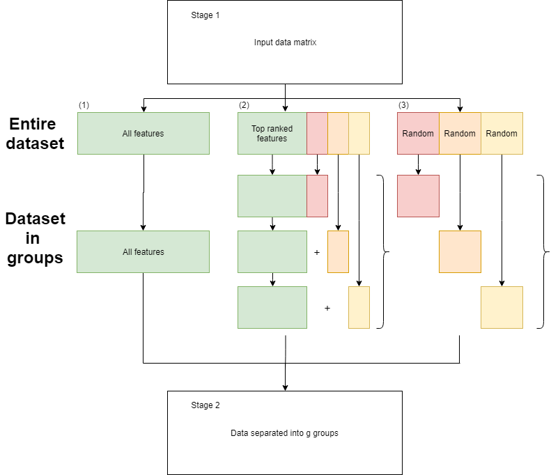
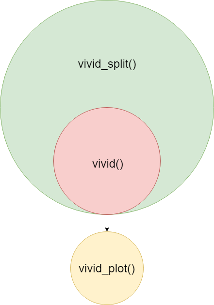

# The **VIVID** package

The **VIVID** (Variability of Variable Importance Differences) package implements both a feature selection method and visualization for complex data. Similar to filter methods, we utilize feature rankings but then proceed to make decisions on how these ranks change over resamples. This information is then visualized through a heat map style plot which highlights groups of features with lower variability in there rankings. When using this package, you are able to identify features which are shown to be important when modeling a response feature such as treatment and control groups of a disease. You are also then able to use visualization to see how this group of features compares with other suitable candidate groups of a similar nature.

## Goals

Within VIVID we aim to achieve a variety of goals which include:

1. Remove the arbitrary cut-off employed when selecting the top $k$ features through a filtering style method.
2. VIVID uses more re-sampling information before aggregating the data down to single values.
3. Considers pairwise comparisons of importance metrics over B re-samples.
4. Provides a visualization method, through which key features can be identified.

# Methodology

When a regression model is fit to data, the size of corresponding coefficients, relative to other features, highlights how important a given feature is. We use the feature rankings of these measures to then observe how pairs of features change relative to other features around them. Groups of features with smaller variability are then identified and considered a candidate group. Given a dataset where only a few features are important (sparse), the majority will have true coefficients equal to 0 creating a large group of features whose ranks vary significantly. These candidate models are then compared and the most optimal solution picked. A detailed version of the method is outlined below.

## VIVID Method

1. Obtain a dataset containing a design matrix $X$ with $p$ features and $n$ observations and a response vector $y$ of corresponding length with two classes. 
2. Fit regression models to resampled data:
    + Bootstrapping is performed by generating new observation weights from the data. These weights are generated from an $exp(1)$ distribution and sum to $n$.
    + A logistic regression is then fit to each re sample using Ridge estimates.
3. Calculate measures of feature importance $s_i$ by taking the absolute value of the regression coefficients, $s_i = |\hat{\beta}_i|$.
4. Calculate the variance of each pairwise comparison of ranks between two features, $h_{ij} = var(r_i - r_j)$.
5. The features are then clustered using the corresponding rows in the $p$ by $p$ matrix $H$ constructed in step (4).
6. The algorithm then searches through the dendogram to find the groups of features with the lowest pairwise variance.
7. Once the groups of features have been identified, the Extended Bayesian Information Criterion (EBIC) is then used to identify the best group of features.

Due to the construction of a $p$ by $p$ matrix, if $p$ is two large a divide and conquer method is implemented, as seen in Figure 1.


Once **VIVID** has been applied to a dataset, there is also a way of visualizing the information gathered throughout.

# The *sacurine* dataset

Insert some information about the dataset here.

# Hands-on

## Required Packages

For the use of **VIVID** the following packages are required (we provide both the install and loading commands):

```{r eval = FALSE}
install.packages('latticeExtra') #required for visualisation
install.packages('tidyverse')
install.packages('furrr') #required for parrallel processing
install.packages('glmnet')
install.packages('parallel')
install.packages('future')
install.packages('dendsort')
install.packages('stringr')

if (!requireNamespace("BiocManager", quietly = TRUE))
    install.packages("BiocManager")
BiocManager::install("ropls") #sacurine data
```

```{r warning=FALSE, message=FALSE}
library('latticeExtra')
library('tidyverse')
library('furrr')
library('glmnet')
library('ropls')
library('parallel')
library('future')
library('dendsort')
library('stringr')
```

Once all these packages have been installed, **VIVID** is ready to be installed.

## Loading

We first load the **VIVID** package:

```{r}
library(VIVID)
```


## *VIVID* feature selection

The first step is to identify all the features to be included in the comparison. Since no pre-filtering step is being implemented we will use all features.

```{r}
sacurine = readRDS("sacurine.rds")


dat <- sacurine$dataMatrix
outcomes <- sacurine$sampleMetadata$gender

p <- NCOL(dat) # p = 109
p
```

The remaining parameters which can be set adjusted:

- **bootstraps**: number of resamples to be completed (should change depending on data size)
- **cores**: how many cores to use for the parallel implementation of model fitting.
- **seed**: seven digits to allow to for reproducible results.
- **lambda**: the values of lambda used to select the optimal regression fit; see **glmnet** for explanation.
- **compare_method**: method of comparison between models. EBIC is chosen as the default method.
- **gamma**: If **compare_method** = "EBIC" then this feature is used.
- **min_size**: When identifying important sets of features when searching through the dendogram, 

If no input is given, then each feature will resort to their default values:

- bootstrap = 100
- cores = 1
- seed = 1234567
- lambda = lambda.1se
- compare_method = EBIC
- gamma = 1
- min_size = 2


```{r}
vivid.sacurine <- vivid(x = dat,
                        y = outcomes,
                        bootstraps = 75,
                        cores = detectCores() - 1,
                        seed = 1234567,
                        lambda = 'lambda.min',
                        compareMethod = 'BIC')
```

The function returns the following outputs:

- **coefficients**: a matrix containing all regression estimates from the resamples. This is a $p$ by $B$ matrix.
- **var_mat**: a matrix containing the variance of the resampled difference in feature ranks. This is a $p$ by $p$ matrix.
- **var_clust**: a hierarchical cluster analysis performed on the above variance matrix. This is a hclust object returned from the function **hclust**.
- **selection**: a binary matrix which contains the features selected at each stage VIVID method. A FALSE indicates the feature is not included and a TRUE indicates the variable is included. This is a $p$ by $k$ matrix, where $k$ is the number of distinct groups of features identified.
- **sizes**: a vector containing the sizes of all distinct groups of features identified.
- **compare_method**: used to identify what function was supplied as an input.
- **compare_values**: the values produced from the comparison method for the groups of features identified.
- **opt_model**: a binary vector of length $p$ identifying the group of features which best optimize the comparison method, features are identified/ignored with the value of TRUE/FALSE respectively.
- **opt_features**: a vector containing the names of the features in the optimal group of features.

## Function Output {.tabset}

### Coefficients

```{r}
vivid.sacurine$coefficients[,1:6] %>% head()
```

### Variance matrix

```{r}
vivid.sacurine$varMat[,1:6] %>% head()
```

### Clustering

```{r}
vivid.sacurine$varClust
```

### Feature group selection (Boolean)

```{r}
vivid.sacurine$selection[,1:6] %>% head()
```

### Feature group sizes

```{r}
vivid.sacurine$sizes
```

### Method of comparison

```{r}
vivid.sacurine$compareMethod
```

### Comparison values

```{r}
vivid.sacurine$compareValues
```

### Best feature group (Boolean)

```{r}
vivid.sacurine$optModel %>% head()
```

### Best feature group (Names)

```{r}
vivid.sacurine$optFeatures
```

## Number of features returned

If the number of features returned is to small, there are several options on how to deal with this situation.

1. Using the function vivid_adj() you can define the minimum number of features you require and this will select the candidate group with size larger than this group.

```{r eval = FALSE}
# Minimum number of final features set to 10
vivid_adj(vivid.sacurine, 
          minFinalFeatures = 10)
```

2. Instead of running the VIVID function all over again, there is simple code to change the objective function used. To complete this use the following function:

```{r eval = FALSE}
# Change from BIC to AIC
vivid.saccurinenew <- vivid_crit(vivid.sacurine,
                                 x = dat,
                                 y = outcomes,
                                 metric = "AIC")
```

## Large number of features

If the dataset has a large number of features then the variance matrix will be large. Since this matrix is of the order $p^2$, we have implemented a divide and conquer approach. Figure 1 describes the VIVID method when we use this approach.


The way this functions is by dividing the data into $g$ different groups and then applying VIVID to each group and identifying the best features. We then combine those set of features and run VIVID again to select the final features. There are multiple ways to split the data, however in this package we have decided to implement only two. This is done by either using disjoint groups or overlapping groups as seen in Figure 2.



To run this version of the code, the following function is used.

```{r eval = FALSE}
vivid.sacurine_split <- vivid_split(x = dat,
                        y = outcomes,
                        bootstraps = 75,
                        cores = detectCores() - 1,
                        seed = 1234567,
                        lambda = 'lambda.min',
                        compareMethod = 'BIC',
                        groups = 5,
                        disjoint = TRUE)
```

The only new features added are:

- **groups**: number of groups, $g$, to divide the data into
- **disjoint**: TRUE or FALSE of whether you want the groups to be disjoint.
- **rep_features**: the column numbers of the features you want to be in each group if the groups are not disjoint.

The output will be similar for the **vivid** output but contain a list of $g+1$ **vivid** outputs where the variance matrix is only included for the final iteration. The structure of the functions can bee seen in Figure 3.



## Visualisation

A major part of this package is the visualization of the information collected. This is done through the use of a heat map style plot. To produce the plot from any vivid output use the code:

```{r eval = FALSE}
vivid_plot(vivid_obj = vivid.sacurine)
```

If the function **vivid_split()** was used then the feature then we set **vivid_split** = TRUE.

From he above plot we can see that when are area is blue that means small variance and when an area is pink that identifies an area of higher variance. Through **VIVID** we effectively searched along this matrix for groups along the diagonal which identified themselves with small variance.


# Other datasets

To be finished.

# Session info

Here is the output from **sessionInfo** for the system on which this vignette was compiled.

```{r}
sessionInfo()
```

